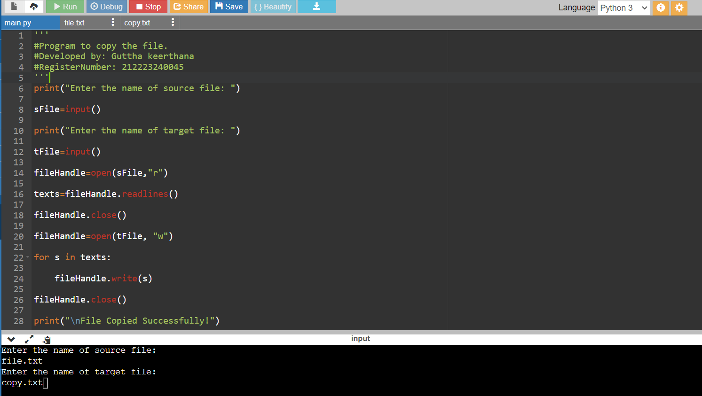
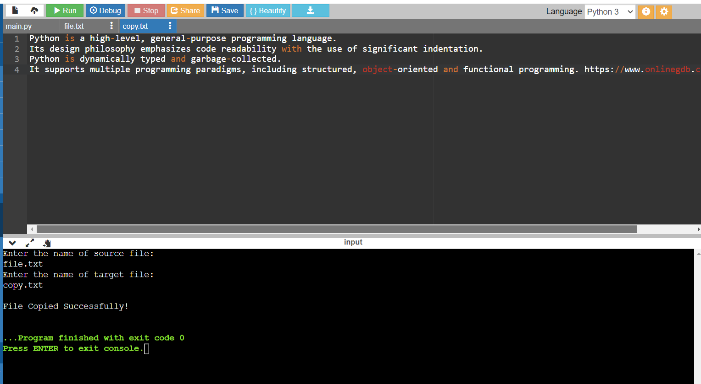

# copy-file
## AIM:
To write a python program for copying the contents from one file to another file.
## EQUIPEMENT'S REQUIRED: 
PC
Anaconda - Python 3.7
## ALGORITHM: 
### Step 1:
Get the file name to create user
### Step 2: 
Give a new file name to create a copy of a file content
### Step 3: 
Read the file and close the file
### Step 4:  
Now type the content in the new file
### Step 5: 
When done print "File copied successfully"
### Step 6: 
End the program
## PROGRAM:

### OUTPUT:

## RESULT:
Thus the program is written to copy the contents from one file to another file.